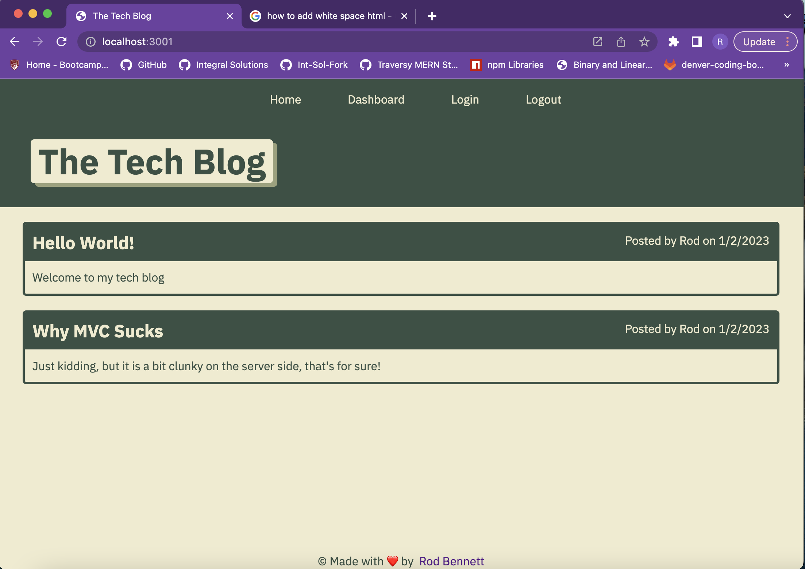
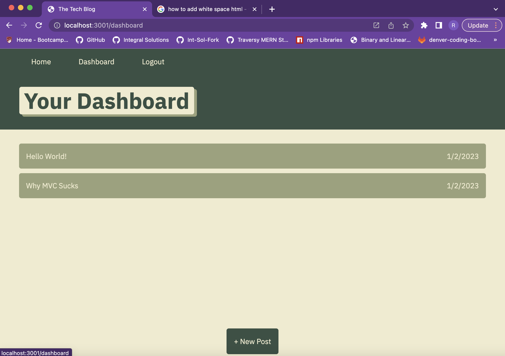
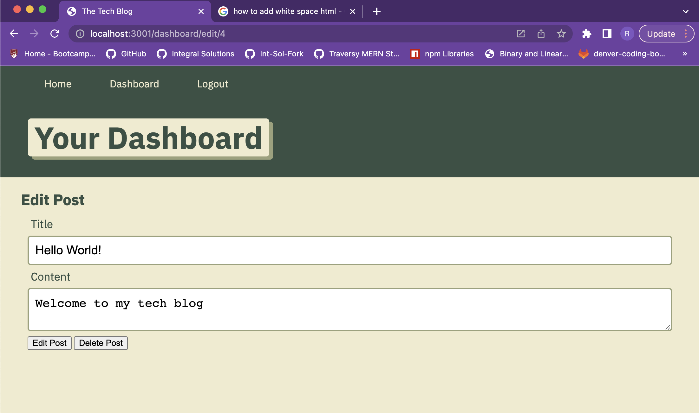
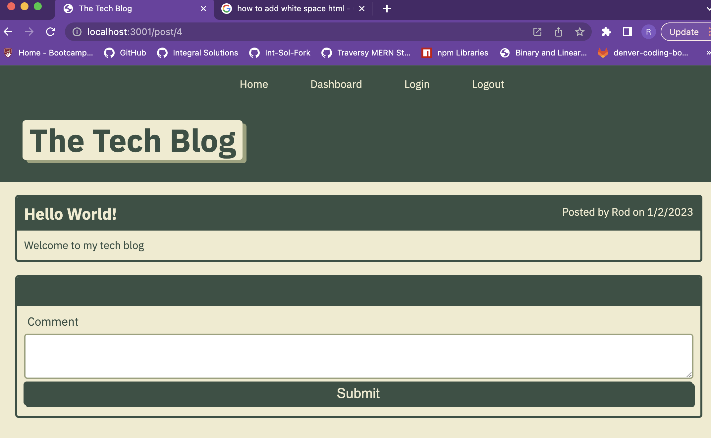

# 🧑🏻‍💻 Model-View-Controller (MVC): Tech Blog 🧑🏻‍💻

[](https://opensource.org/licenses/MIT)

### Heroku Deployment link: https://rb-tech-blog.herokuapp.com/

## Overview

In this full-stack MVC application, I created a tech blog where users can sign up, log in, create new posts, edit posts, and comment on others' posts.

## Table of Contents

- [Acceptance Criteria](#acceptance-criteria)
- [Static Screenshots](#static-screenshots)
- [Technology Used](#technology-used)
- [Contributing](#contributing)
- [Challenges](#challenges)
- [Future Development](#future-development)
- [License](#license)
- [Contact Info](#contact-info)

## Acceptance Criteria

```md
GIVEN a CMS-style blog site
WHEN I visit the site for the first time
THEN I am presented with the homepage, which includes existing blog posts if any have been posted; navigation links for the homepage and the dashboard; and the option to log in
WHEN I click on the homepage option
THEN I am taken to the homepage
WHEN I click on any other links in the navigation
THEN I am prompted to either sign up or sign in
WHEN I choose to sign up
THEN I am prompted to create a username and password
WHEN I click on the sign-up button
THEN my user credentials are saved and I am logged into the site
WHEN I revisit the site at a later time and choose to sign in
THEN I am prompted to enter my username and password
WHEN I am signed in to the site
THEN I see navigation links for the homepage, the dashboard, and the option to log out
WHEN I click on the homepage option in the navigation
THEN I am taken to the homepage and presented with existing blog posts that include the post title and the date created
WHEN I click on an existing blog post
THEN I am presented with the post title, contents, post creator’s username, and date created for that post and have the option to leave a comment
WHEN I enter a comment and click on the submit button while signed in
THEN the comment is saved and the post is updated to display the comment, the comment creator’s username, and the date created
WHEN I click on the dashboard option in the navigation
THEN I am taken to the dashboard and presented with any blog posts I have already created and the option to add a new blog post
WHEN I click on the button to add a new blog post
THEN I am prompted to enter both a title and contents for my blog post
WHEN I click on the button to create a new blog post
THEN the title and contents of my post are saved and I am taken back to an updated dashboard with my new blog post
WHEN I click on one of my existing posts in the dashboard
THEN I am able to delete or update my post and taken back to an updated dashboard
WHEN I click on the logout option in the navigation
THEN I am signed out of the site
WHEN I am idle on the site for more than a set time
THEN I am able to view comments but I am prompted to log in again before I can add, update, or delete comments
```

## Static Screenshots

### - Homepage before loggin in


### - Dashboard with User Context posts only


### - Edit post functionality


### - Comment on others' posts


## Technology Used
- [express.js](https://expressjs.com/): for routing
- [espress-session](https://www.npmjs.com/package/express-session): npm for login sessions
- [Handlebars](https://handlebarsjs.com/): for Views and Layouts
- [bcrypt](https://www.npmjs.com/package/bcrypt): npm for password hashing
- [mysql / mysql12](https://www.npmjs.com/package/mysql2): for database and schema
- [sequelize](https://sequelize.org/): for ORM database relations
- [nodemon](https://www.npmjs.com/package/nodemon): development tool for real-time updating

## Contributing
As this was a project for the University of Denver bootcamp, no outside contributions are being accepted at this time.

## Challenges
This was definitely the most challenging assignment of the bootcamp so far.  The first challenge was learning how to tease out back-end routes from front-end ones.  That in itself was a major obstacle that took me considerable amounts of time to understand.  The second challenge was in Handlebars itself, which, combined with routes, made for some difficult programming.  On the the other hand, no assignment has taught me more about back-end development than this one, and even though I am aware that Handlebars is hardly ever used in the development community, I am confident that the logic behind this assignemnt will come in handy for all of my full-stack development projects.

## Future Development
In the future, I would like to add more styling to this blog to make the UI better.

## License
[](https://opensource.org/licenses/MIT)

## Contact Info

- Rod's email: rod.bennett75@gmail.com
- [Rod's Github Profile](https://github.com/RodBennett)
